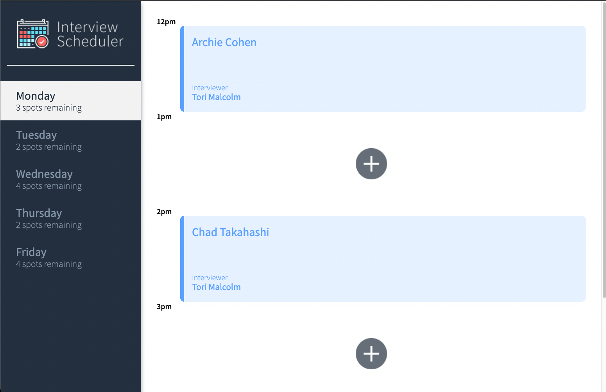
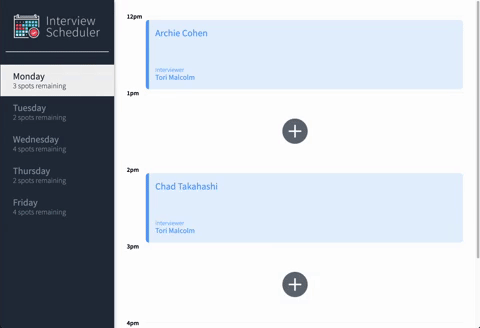
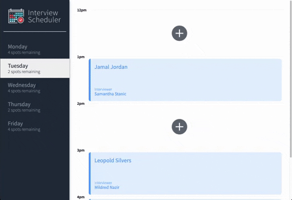
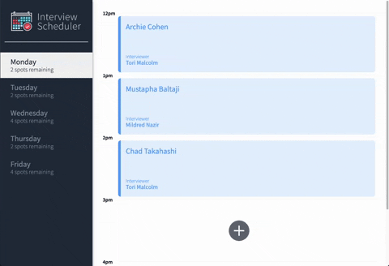
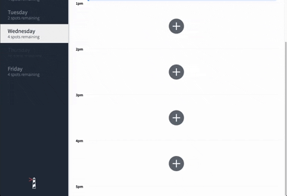
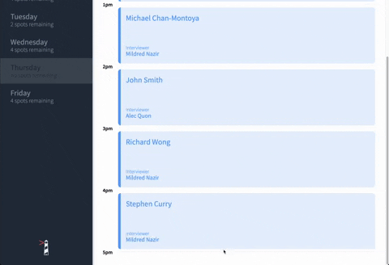
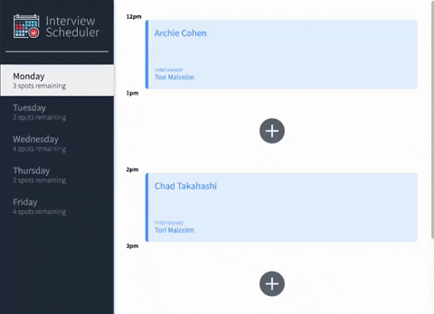
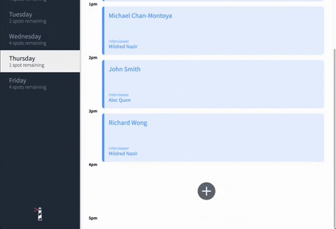
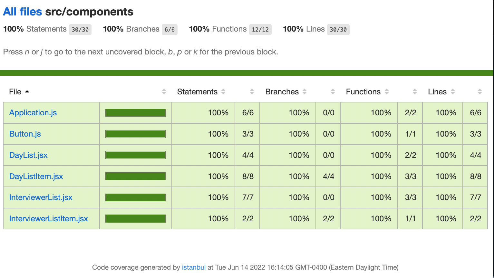
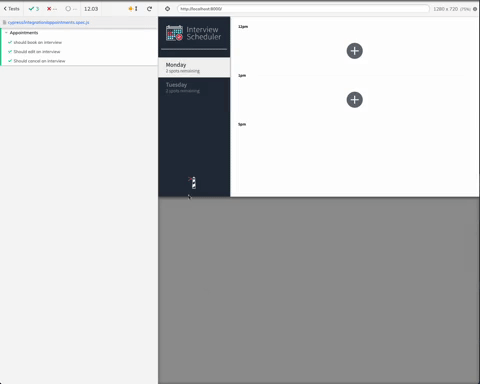

# Interview Scheduler
- React project designed for making appointments or booking interviews.
- Single page web application that allows users to book interviews between 12p-5pm, Monday to Friday
## Setup

Install dependencies with `npm install`.

## Running Webpack Development Server

```sh
npm start
```

## Running Jest Test Framework

```sh
npm test
```

## Running Storybook Visual Testbed

```sh
npm run storybook
```

## Final Product

### Home page
  
### Booking an interview 

### Editing an interview

### Deleting an interview

### Error Handling


### Responsive Design 

### Dynamic Design

### Unit Testing Coverage

### Integration Testing (Cypress)



